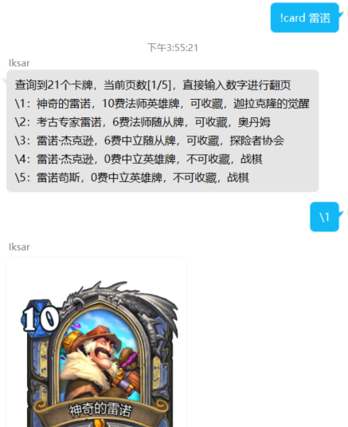
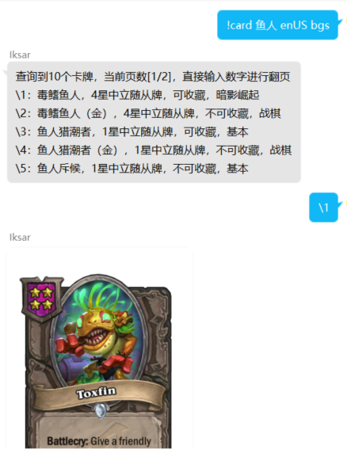
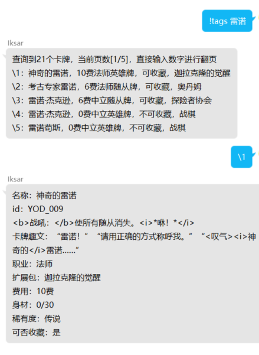
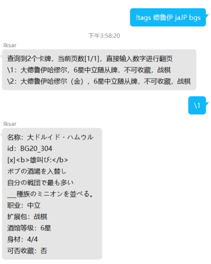
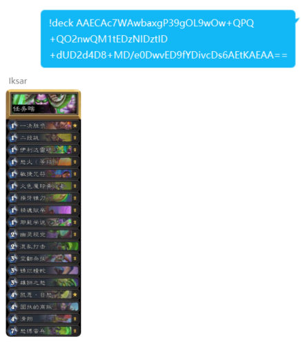
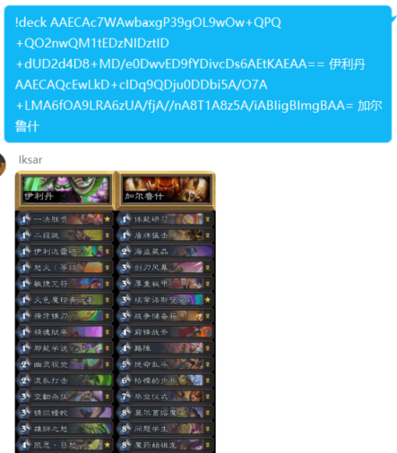

# 功能列表

## 帮助

```
!help
```

## Card插件

### 查找卡牌图片

```
!card
```

| 参数     | 必须               | 备注                   |
| -------- | ------------------ | ---------------------- |
| 卡牌名   | :heavy_check_mark: | 支持多关键字           |
| 语言代码 |                    | 默认值 zhCN             |
| bgs      |                    | 如指定，则搜索战棋随从 |

目前支持的语言代码为
| 代码 | 语言             |
| ---- | ---------------- |
| deDE | 德语             |
| enUS | 英语             |
| esES | 西班牙语         |
| esMX | 西班牙语(墨西哥) |
| frFR | 法语             |
| itIT | 意大利语         |
| jaJP | 日语             |
| koKR | 韩语             |
| plPL | 波兰语           |
| ptBR | 葡萄牙语         |
| ruRU | 俄语             |
| thTH | 泰语             |
| zhCN | 简体中文         |
| zhTW | 繁体中文         |




### 卡牌文字信息

```
!tags
```

| 参数     | 必须               | 备注                   |
| -------- | ------------------ | ---------------------- |
| 卡牌名   | :heavy_check_mark: | 支持多关键字           |
| 语言代码 |                    | 默认值 zhCN             |
| bgs      |                    | 如指定，则搜索战棋随从 |




### 卡牌原画

```
!ori
```

| 参数   | 必须               | 备注         |
| ------ | ------------------ | ------------ |
| 卡牌名 | :heavy_check_mark: | 支持多关键字 |


## Deck插件

```
!deck
```

| 参数     | 必须               | 备注                                           |
| -------- | ------------------ | ---------------------------------------------- |
| 卡组代码 | :heavy_check_mark: |                                                |
| 卡组名称 |                    | 如不指定，则会自动辨别卡组名称（仅限标准卡组） |

扩展用法：
1. ```!deck 卡组代码1 卡组名称1 卡组代码2 卡组名称2 ......```
2. ```!deck 卡组代码1 卡组代码2 卡组代码3 卡组名称```
3. ```!deck.enUS 卡组代码 卡组名称``` 可输出英文卡组图片




## 其他功能

1. 自动同意加群邀请和好友申请（须在环境文件中将 `AUTO_AGREE` 置为 `true`）